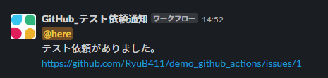

# demo_github_actions

## 参考リンク
[GitHub Actions のクイックスタート - GitHub Docs](https://docs.github.com/ja/actions/quickstart)

## 手順
### SlackWorkFlowを作成
  
+ 例として、GitHubからのパラメータを受け取り、Slackにメッセージを送信するステップを作成


+ 「ウェブリクエストのURL」は後のSecretsに設定するので、控えておく
+ 変数はtextを利用する。
(GitHub Actions側で規定あり)
### GitHub側にワークフローを作成
+ Secrets設定に、先ほど控えたSlackのリクエストのURLを追加する。


+ 対象のリポジトリに以下フォルダ、ファイルを作成する
  /.github/workflows/[任意の名称].yml

プロジェクトのカードが任意のカラムに移動した時の制御を行う場合、  
以下のように記載する。  

```yml
name: Project Card Demo
on:
  project_card:
    types:
      - moved
jobs:
  notification_slack:
    runs-on: ubuntu-latest
    if: github.event.project_card.column_id == '12345678'
    steps:
      - name: get_issue_info
        id: issue_url
        run: |
          url=`echo ${{ github.event.project_card.content_url }} | sed -e "s/api\.//"`
          url=`echo $url | sed -e "s/repos\///"`
          echo "::set-output name=MY_VALUE::${url}"
      - name: Slack Notification
        uses: tokorom/action-slack-incoming-webhook@main
        env:
          INCOMING_WEBHOOK_URL: ${{ secrets.SLACK_WEBHOOK_URL }}
        with:
          text: ${{ steps.issue_url.outputs.MY_VALUE }}
```

'12345678'の部分には、検知したいカラムのIDを記載する。
カラムのIDは、対象のカラムの「…」を選択→Copy Column Linkを選択後  
コピーしたURLの末尾の数字から確認出来る。

#### 結果
プロジェクトのカラム「テスト依頼」にIssueを移動すると、Actionsが開始され　　
Slackにメッセージ送信される。  


